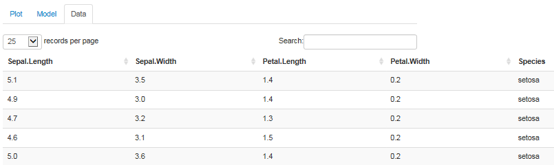

<style>
em {
  font-style: italic
}
code {
  font-size: 0.75em
}
</style>

## The Iris data set

- Edgar Anderson's iris data is provided as part of the `datasets` package in R.  From the R documentation:

*This famous (Fisher's or Anderson's) iris data set gives the measurements in centimeters of the variables sepal length and width and petal length and width, respectively, for 50 flowers from each of 3 species of iris. The species are Iris setosa, versicolor, and virginica.*

- The `iris` data frame contains three categories of variables: sepal dimensions, petal dimensions, & species.

```{r, echo = F}
str(iris)
```

---

## The 'Plot' tab

- Produces a scatter plot visualizing the relationiship between the selected variables
- First & second variables as x- & y-axis; response variable as point size; species as point color

```{r, echo = F, fig.width = 12, fig.height = 6}
library(ggplot2)
qplot(Sepal.Length, Sepal.Width, data = iris, size = Petal.Length, color = Species)
```

---

## The 'Model' tab

- Performs a linear regression among the selected variables and summarizes the result
- First & second variables as explanatory; response variable as outcome

```{r, echo = F}
summary(lm(Petal.Length ~ Sepal.Length + Sepal.Width, data = iris))
```

---

## The 'Data' tab

- Allows exploration of the full data set, including pagination, sorting, filtering, & search
- Always shows entire data set; not affected by the variable controls on the side panel

<div style='text-align: center;'>
    
</div>

<footer>
Try <a href="https://waingold.shinyapps.io/IrisExplorer/">Iris Explorer</a> now!
</footer>
